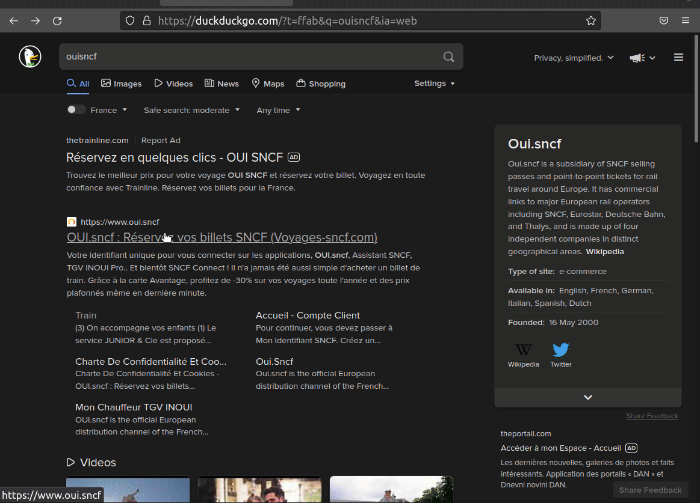

# TGVMax Finder


## Setup

<b>Python 3.10+</b> is required. 

Create and fill a `.env` file with your cookies contents, your birthdate and your TGVMax card number.
<details>
  <summary><b>Follow</b> this tutorial to get your <code>sncf-connect.com</code> cookies. Reproduce it once you are connected to your account.  
  <i>Altough the website presented is the old <code>oui.sncf</code>, it still working on <code>sncf-Connect.com</code></i></summary>



</details>


## Run
```
Usage: main.py [-h] [-t TIMEDELTA] [-p PERIOD] [-d] [-b] [--via VIA] [-l] [-q] [-v] station station

Positional arguments:
  station               Station names

Options:
  -h, --help                                    Show this help message and exit
  -t TIMEDELTA, --timedelta TIMEDELTA           How many days from today
  -p PERIOD, --period PERIOD                    Number of days to search
  -d, --direct-only                             Print direct proposals only
  -b, --berth-only                              Print berth only for Intercites de Nuit proposals
  --via VIA                                     Force connection station with specified name
  -l, --long                                    Add details for prompted proposals, including transporter and vehicle number
  -q, --quiet                                   Only show results
  -v, --verbosity                               Verbosity
```
## Examples :

`python3 main.py Avignon-TGV Lyon --timedelta 0` Find next TGVMax trains available from Avignon-TGV to Lyon for today.  
`python3 main.py Nice Paris --timedelta 7` Find next TGVMax trains available from Nice to Paris in 7 days.  
`python3 main.py Paris Brest --timedelta 7 --period 5` Find next TGVMax trains available from Paris to Brest for the 5 next days of the next week.  
`python3 main.py Paris Lyon --direct-only` Find only direct TGVMax trains available from Paris to Lyon tomorrow.  
`python3 main.py Paris Lyon --berth-only` Find TGVMax trains available from Paris to Marseille tomorrow and show nights trains only available with berths.  
`python3 main.py Montpellier Paris --via Narbonne` Find TGVMax trains available from Montpellier to Paris for tomorrow via Narbonne only.  
`python3 main.py Paris Lyon --long` Find TGVMax trains available from Paris to Lyon for tomorrow and show trains transporters & numbers .


### Example output
```shell
$ python3 main.py  paris nice --quiet --timedelta 26 --direct-only --long
```
```
mar. 01 févr. 2022 00:00:00
Direct journey from Paris (toutes gares intramuros) to Nice (toutes gares)
Paris Gare de Lyon (09:09) → nice ville (15:07) TGV INOUI 6173 | +10 seats remaining  
Paris Gare de Lyon (17:09) → nice ville (23:07) TGV INOUI 6181 | +10 seats remaining  
Paris Auterlitz (21:20) → nice ville (09:08) INTERCITES DE NUIT 5771 | +10 seats and +10 berths remaining  
```
