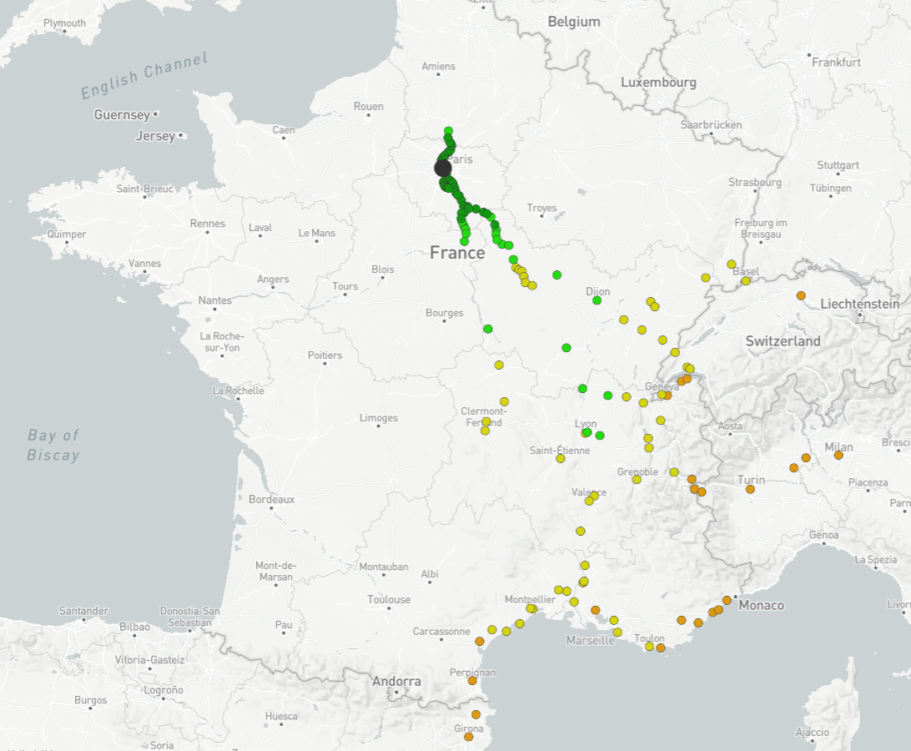

# TGVMax Finder

> #### Le but de cet outil est de permettre de trouver les trajets TGVmax disponibles entre deux villes.
>#### Il est possible de choisir le nombre de trajets à afficher et de choisir la date de départ ainsi que le nombre de jours à afficher.
>#### À terme, il sera possible de trouver les trajets TGVmax entre deux villes en intégrant le découpage du trajet, afin de maximiser les chances de trouver un trajet même lors des périodes de forte affluences.

## Méthodes pour récupérer les trajets directs

L'étape la plus simple a été de récupérer les trajets directs entre la gare de départ et la gare d'arrivée.  
Il a fallu ensuite filtrer ces résultats pour ne conserver que les trajets éligibles TGVmax (dont le prix est de 0€).
Afin de récupérer ces trajets, je me suis basé sur
le [travail](https://github.com/benoitdemaegdt/TGVmax/blob/master/doc/sncf.md) de @benoitdemaegdt. Comme lui, j'ai fait
le choix de récupérer les trajets sur le site du canal de vente de la SNCF : [Oui.SNCF](https://www.oui.sncf). Ce fut
l'étape la plus rapide et la plus facile à réaliser.

## Trajets indirects : la grande inconnue

Cependant, il n'était pas possible de récupérer les trajets qui comprenaient une ou plusieurs correspondances. J'ai donc
dû trouver une méthode pour récupérer les trajets avec correspondances tout en prenant en compte qu'il fallait parfois
provoquer volontairement celles-ci lorsque les trains directs sont complets et que l'on souhaite découper son trajet. De
plus, il fallait tenir compte que les trajets proposés en correspondances étaient susceptibles d'être à bord de TERs 
(Trains Express Régionaux) qui ne sont pas éligibles à TGVmax. J'ai d'abord cherché les moyens d'obtenir les gares
intermédiaires communes entre les deux gares. J'étais déjà tombé sur l'outil direkt.bahn.guru qui permet d'afficher sur
une carte interactive l'ensemble des destinations atteignables à partir d'une gare.

#### https://direkt.bahn.guru/?origin=8700012

Après une retro-ingénierie, j'ai identifié l'API utilisé pour obtenir les gares atteignables. Contre toute attente, la
base de données utilisée provenait de HAFAS, un logiciel de calcul d'itinéraire. Les données quant à elles sont celles
de la Deutsche Bahn, l'entreprise ferroviaire publique allemande, qui a accès à la base de données des gares
ferroviaires en France.

